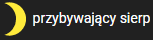
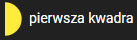
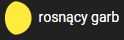
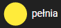
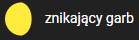
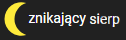

# Projekt_gwiazdy

<br>

## Opis
Aplikacjia do zarządzania wyglądem nocnego nieba

Uaga aplikacja korzysta z serwera bekend który znajduje sie [tutaj]()

Aplikacja składa się z 2 podstron: `Pogoda` i `Edycja nieba`
- Podstrona `pogoda` pozwala dla danej daty z kalendarza na ustawienie parametrów pogodowych takich jak: Faza księzyca, Poziom zachmurzenia, Poziom mgły oraz Rodzaj Opadu
- Podstrona `Edycja nieba` składa się z 3 sekcji:
    - Gwiazdy - w tej sekcji można przegłądać, edytować i zarzącać gwiazdami
    - Konstelacje - w tej sekcji morzna przegłądać, edytować i zarzącać kontelacjami
    - Mapa nieba - ta sekcja jest reprezentacją nieba na której są wyśwetlane gwazdy. 


<br>


---

## Uruchomienie Frontu
### Instalacja zależności
```bash
yarn
# lub
npm install
```

### Uruchomienie serwera w trybie deweloperskim
```bash
quasar dev
```

### Zbudowanie aplikacji do produkcji
```bash
quasar build
```
---

<br>
<br>

---

## Funkcje Aplikacji

Podstrona `Pogoda`:
 - kalendarz - jeżeli pod daną datą jest kropka oznacza to że parametry dla danego dania zostały już przypisane
 - Faza księżyca - jest to slider na którym można wybrać 1 z 8 dostępnych faz księzyca 
    - 
    - 
    - 
    - 
    - 
    - 
    - 
    - 
 - Poziom zachmurzenia - slider w 10 stopniowej skali
 - Poziom mgły - slider w 10 stopniowej skali
 - Rodzaj opadu - slider w 5 stopniowej skali

Podstrona `Edycja nieba`:
- Gwiazdy:
    - usuwanie gwiazd
    - dodawanie nowych gwiazd
    - Możliwośc pokazania gwiazdy na niebie.
    - Wyśwetlenie informacji o gwieździe: Zdjęcie, Nazwa, Opis, Pozycja na niebie (x, y), Status (Zapalona/Zgaszona), Kontelacje - nazwy kontelacji w jakich znajduje się dana gwiazda
    - Edycja informacji o gwieździe: Nazwa, Opis, Link do zdjęcia, Pozycja x, Pozycja y
    - Zarządzanie stanem gwiazdy
    - Zarządzanie przynależności do danej kontelacji (dodawanie/usuwanie z konstelacji)
- Konstelacje
    - usuwanie kontelacji
    - dodawanie nowych konstelacji
    - Możliwośc pokazania kontelacji na niebie.
    - Wyśwetlenie informacji o kontelacji: Zdjęcie, Nazwa, opis, Gwiazdy - nazwy gwiazd wchodzących w skład kontelacji
    - Edycja informacji o konstelacji: Nazwa, Opis, Link do zdjęcia
    - Zarządzanie przynależnością gwaizd do konstelacji (dodawanie usuwanie)
    - Zarządzanie stanem gwiazd dla całej konstelacji - możliwość zgaszenia i zapalenia wszystkich gwiazd znajdujących się w danej konstelacji
- Mapa Nieba - jest to odworowanie nocnego nieba na którym znajdują się gwiazdy. Na mapie jest nałożona siatka która pozwala na łatwiejsze poruszanie się po niebie i przeglądanie gwiazd. Po kliknięci na daną gwiazdę zostają wyśwetlone informacje o klikniętej gwieździe. Po kliknięci przycisku pokaż znajdującego się przy danej gwieździe lub kontelacji odpowiednie gwiazdy zostaną zaznaczone zieloną ramką i pokazane na mapie nieba

---

