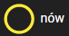

# Projekt_gwiazdy

<br>

## Opis
Aplikacja do zarządzania wyglądem nocnego nieba

Aplikacja jest dostępna pod adresem
https://gwiazdy.srym.pl/

Uwaga aplikacja korzysta z serwera backend który znajduje sie [tutaj](https://github.com/SzymonRcode/GwiazdyApp)

Aplikacja składa się z 2 podstron: `Pogoda` i `Edycja nieba`
- Podstrona `pogoda` pozwala dla danej daty z kalendarza na ustawienie parametrów pogodowych takich jak: Faza księżyca, Poziom zachmurzenia, Poziom mgły oraz Rodzaj Opadu
- Podstrona `Edycja nieba` składa się z 3 sekcji:
    - Gwiazdy - w tej sekcji można przeglądać, edytować i zarządzać gwiazdami
    - Konstelacje - w tej sekcji można przeglądać, edytować i zarządzać kontentacjami
    - Mapa nieba - ta sekcja jest reprezentacją nieba na której są wyświetlane gwiazdy. 


<br>


---

## Uruchomienie Frontu
### Instalacja zależności
```bash
yarn
# lub
npm install
```

### Uruchomienie serwera w trybie deweloperskim
```bash
quasar dev
```

### Zbudowanie aplikacji do produkcji
```bash
quasar build
```
---


### Konfiguracja połączenia do serwera api
>.env
```
ApiURL="url"
ApiLogin="login"
ApiPassword="password"

```


## Funkcje Aplikacji

Podstrona `Pogoda`:
 - kalendarz - jeżeli pod daną datą jest kropka oznacza to że parametry dla danego dania zostały już przypisane
 - Faza księżyca - jest to slider na którym można wybrać 1 z 8 dostępnych faz księżyca 
    - 
    - 
    - 
    - 
    - 
    - 
    - 
    - 
 - Poziom zachmurzenia - slider w 10 stopniowej skali
 - Poziom mgły - slider w 10 stopniowej skali
 - Rodzaj opadu - slider w 5 stopniowej skali

Podstrona `Edycja nieba`:
- Gwiazdy:
    - usuwanie gwiazd
    - dodawanie nowych gwiazd
    - Możliwość pokazania gwiazdy na niebie.
    - Wyświetlenie informacji o gwieździe: Zdjęcie, Nazwa, Opis, Pozycja na niebie (x, y), Status (Zapalona/Zgaszona), Konstelacje - nazwy konstelacji w jakich znajduje się dana gwiazda
    - Edycja informacji o gwieździe: Nazwa, Opis, Link do zdjęcia, Pozycja x, Pozycja y
    - Zarządzanie stanem gwiazdy
    - Zarządzanie przynależności do danej konstelacji (dodawanie/usuwanie z konstelacji)
- Konstelacje
    - usuwanie konstelacji
    - dodawanie nowych konstelacji
    - Możliwość pokazania konstelacji na niebie.
    - Wyświetlenie informacji o konstelacji: Zdjęcie, Nazwa, opis, Gwiazdy - nazwy gwiazd wchodzących w skład konstelacji
    - Edycja informacji o konstelacji: Nazwa, Opis, Link do zdjęcia
    - Zarządzanie przynależnością gwiazd do konstelacji (dodawanie usuwanie)
    - Zarządzanie stanem gwiazd dla całej konstelacji - możliwość zgaszenia i zapalenia wszystkich gwiazd znajdujących się w danej konstelacji
- Mapa Nieba - jest to odwzorowanie nocnego nieba na którym znajdują się gwiazdy. Na mapie jest nałożona siatka która pozwala na łatwiejsze poruszanie się po niebie i przeglądanie gwiazd. Po kliknięci na daną gwiazdę zostają wyświetlone informacje o klikniętej gwieździe. Po kliknięci przycisku pokaż znajdującego się przy danej gwieździe lub konstelacji odpowiednie gwiazdy zostaną zaznaczone zieloną ramką i pokazane na mapie nieba

---

